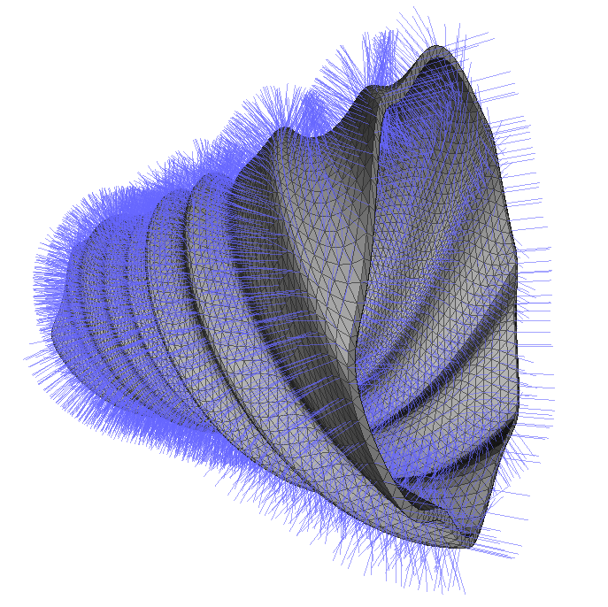

# stl-model - parametric 3D printing

Render weird shapes algorithmically for 3D printing into STL binary format. The example C++ code is using the [Eigen Vector Library](http://eigen.tuxfamily.org/dox/group__QuickRefPage.html).

## Installation

Tested under Fedora Linux 22 - please use
```bash
make install-fc
```
to install dependencies.

## Rendering Shapes
Just run __make <model_name>__ to render a new shape in STL binary format:
```bash
make cup
# g++ vase.cpp `pkg-config eigen3 --cflags` -Wall -Werror -o vase.run
# ./vase.run > vase.stl
```

## Example Rendering



